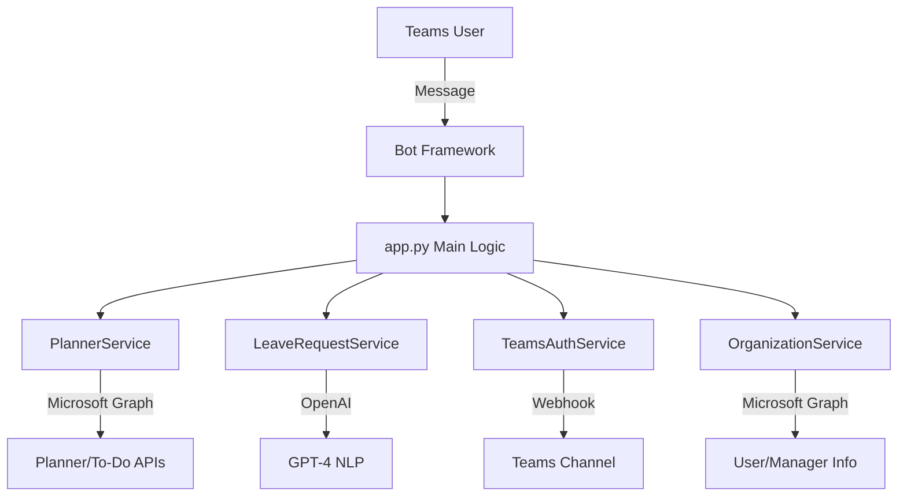

# PMT Bot - Project Management Teams Bot

Microsoft Teams дээрх хэрэглэгчийн даалгавар удирдах, чөлөөний хүсэлт боловсруулах интеллект бот.

## 🚀 Онцлогууд

### 📋 Даалгавар удирдлага

- **Microsoft Planner** интеграци
- **Microsoft To-Do** холболт
- Дутуу даалгавруудыг автоматаар харуулах
- Эрэмбэ болон биелэлтийн хувиар эрэмбэлэх

### 🧠 Интеллект чөлөөний хүсэлт

- **NLP технологи** ашиглан Монгол/Транслит хэлийг ойлгох
- Автоматаар огноо, шалтгаан, хугацаа танилт
- Дутуу мэдээллийг лавлах асуулт асуух
- Лидэрт Teams-ээр мэдэгдэл илгээх

### 🤖 AI Асистент

- **GPT-4** загвар ашиглах
- Монгол хэл болон транслит дэмжлэг
- Контекстод тулгуурласан хариулт

## 📁 Систем бүтэц

```
pmt-bro-01/
├── app.py                     # Bot үндсэн серверийн файл
├── config.py                  # Тохиргооны файл
├── planner_service.py         # Microsoft Planner/To-Do сервис
├── leave_request_service.py   # Чөлөөний хүсэлт NLP сервис
├── teams_auth_service.py      # Teams мессеж илгээх сервис
├── organization_service.py    # Байгууллагын бүтэц сервис
├── run_bot.py                # Bot асаах entry point
├── requirements.txt          # Python dependencies
├── .gitignore               # Git ignore файл
└── README.md               # Энэ файл
```

## 🛠️ Суулгах заавар

### 1. Repository татах

```bash
git clone <repository-url>
cd pmt-bro-01
```

### 2. Virtual environment үүсгэх

```bash
python -m venv venv
source venv/bin/activate  # Linux/Mac
# эсвэл
venv\Scripts\activate     # Windows
```

### 3. Dependencies суулгах

```bash
pip install -r requirements.txt
```

### 4. Орчны хувьсагчид тохируулах

`.env` файл үүсгэж дараах мэдээллийг оруулах:

```env
# Заавал байх ёстой
OPENAI_API_KEY=your_openai_api_key
MICROSOFT_APP_ID=your_bot_app_id
MICROSOFT_APP_PASSWORD=your_bot_password

# Нэмэлт функцуудад
GRAPH_TENANT_ID=your_azure_tenant_id
GRAPH_CLIENT_ID=your_graph_client_id
GRAPH_CLIENT_SECRET=your_graph_client_secret
TEAMS_WEBHOOK_URL=your_teams_webhook_url
```

### 5. Bot асаах

```bash
python run_bot.py
```

## 🔧 API Endpoints

### Health Check

```
GET /
```

Response:

```json
{
  "status": "running",
  "services": {
    "bot_framework": true,
    "openai": true,
    "planner": true,
    "teams_webhook": true
  },
  "version": "1.0.0"
}
```

### Bot Messages

```
POST /api/messages
```

Bot Framework Activity объект хүлээн авч боловсруулна.

## 💬 Хэрэглээний жишээ

### Чөлөөний хүсэлт (Монгол)

```
"Сайн байна уу, би маргааш өвчтэй болоод 1 хоног чөлөө авмаар байна."
```

### Чөлөөний хүсэлт (Транслит)

```
"hi bi margaash 8tsagiin chuluu avmaar baina"
```

### Bot хариулт

1. 📋 Эхлээд дутуу даалгавруудыг харуулна
2. 🧠 Чөлөөний хүсэлт танина
3. 🤔 Дутуу мэдээлэл байвал лавлана
4. 📨 Бүрэн мэдээлэл байвал лидэрт илгээнэ

## 🔑 Гол транслит үгс

| Монгол  | Транслит | Тайлбар         |
| ------- | -------- | --------------- |
| чөлөө   | chuluu   | Амралт          |
| маргааш | margaash | Дараа өдөр      |
| цаг     | tsag     | Цагийн нэгж     |
| хоног   | honog    | Өдрийн нэгж     |
| өвчтэй  | ovchiin  | Өвчний шалтгаан |

## 📊 Системийн архитектур



## 🚨 Алдаа засах

### Алдаануудын түвшин

- ❌ **Критик**: Систем ажиллахгүй
- ⚠️ **Анхааруулга**: Зарим функц ажиллахгүй
- ✅ **Амжилт**: Бүх систем бэлэн

### Нийтлэг асуудлууд

1. **OpenAI API алдаа**

   - API key шалгах
   - API лимит шалгах

2. **Graph API алдаа**

   - Tenant ID, Client ID/Secret шалгах
   - Permissions шалгах

3. **Teams webhook алдаа**
   - Webhook URL зөв эсэхийг шалгах
   - Channel permissions шалгах

## 🤝 Хувь нэмэр оруулах

1. Fork хийх
2. Feature branch үүсгэх
3. Changes хийх
4. Test ажиллуулах
5. Pull request илгээх

## 📝 License

MIT License - дэлгэрэнгүйг `LICENSE` файлаас үзнэ үү.

## 📞 Холбоо барих

Асуудал эсвэл санал байвал GitHub Issues-ээр холбогдоно уу.
