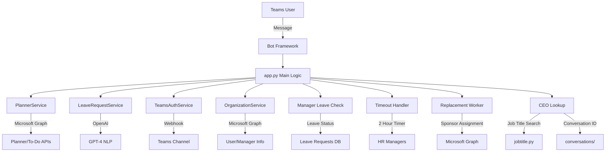

# PMT Bot

Teams чөлөөний хүсэлт bot

## Тохиргоо

### Environment Variables

`.env` файл үүсгэж доорх утгуудыг оруулна уу:

```
# Microsoft Bot Framework
MICROSOFT_APP_ID=your_bot_app_id
MICROSOFT_APP_PASSWORD=your_bot_app_password

# OpenAI (AI parsing-ын тулд)
OPENAI_API_KEY=your_openai_api_key

# Microsoft Graph API (Planner tasks авах)
TENANT_ID=your_azure_tenant_id
CLIENT_ID=your_azure_app_id
CLIENT_SECRET=your_azure_app_secret
```

### Microsoft Graph API Permissions

Planner tasks авахын тулд Azure AD app-д дараах permissions шаардлагатай:

- `Tasks.Read`
- `Tasks.ReadWrite`
- `Group.Read.All` (эсвэл `Group.ReadWrite.All`)

### Суулгах

```bash
pip install -r requirements.txt
python app.py
```

## Онцлогууд

- 🤖 AI ашиглан чөлөөний хүсэлт ойлгох
- 📋 Microsoft Planner tasks мэдээлэл харуулах
- ✅ Manager approval workflow
- 🔗 External API integration
- 📊 Adaptive Cards UI
- 🔄 **Чөлөө авсан manager-ийн manager руу автоматаар илгээх**
- ⏰ **Manager timeout механизм (2 цаг)**
- 👥 **Орлон ажиллах хүн томилох систем**
- 🧹 **Дууссан чөлөөний автомат цэвэрлэлт**

## API Endpoints

- `GET /` - Health check
- `POST /api/messages` - Bot messages
- `GET /users` - Хэрэглэгчдийн жагсаалт
- `POST /leave-request` - Чөлөөний хүсэлт илгээх
- `POST /broadcast` - Бүх хэрэглэгчид мессеж илгээх
- `POST /replacement-worker` - Орлон ажиллах хүн томилох
- `DELETE /replacement-worker` - Орлон ажиллах хүн хасах
- `GET /replacement-workers/<email>` - Орлон ажиллах хүмүүсийг жагсаах
- `POST /auto-remove-replacement-workers` - Чөлөө дуусахад автомат хасах
- `POST /cleanup-expired-leaves` - Дууссан чөлөөний цэвэрлэлт
- `POST /manager-timeout-test` - Manager timeout тест

## Workflow

1. Хэрэглэгч чөлөөний хүсэлт илгээнэ
2. AI мэдээллийг parse хийнэ
3. Planner tasks харуулж баталгаажуулна
4. **Чөлөөний хугацаанаас хамааран Manager тодорхойлно**
   - 3 хоног ба түүнээс доош: Эхлээд manager-ийг олно, чөлөө авсан бол manager-ийн manager руу
   - 4 хоног ба түүнээс дээш: CEO руу шууд илгээнэ
5. Manager руу adaptive card илгээнэ (tasks мэдээлэлтэй)
6. Manager зөвшөөрөх/татгалзах
7. **2 цагийн timeout механизм** - хэрэв manager хариулахгүй бол HR руу мэдэгдэнэ
8. External API руу автоматаар дуудлага хийнэ
9. **Орлон ажиллах хүн томилох** (сонголттой)
10. **Дууссан чөлөөний автомат цэвэрлэлт**

## 📁 Систем бүтэц

```
pmt-bro-01/
├── app.py                     # Bot үндсэн серверийн файл
├── config.py                  # Тохиргооны файл
├── planner_service.py         # Microsoft Planner/To-Do сервис
├── leave_request_service.py   # Чөлөөний хүсэлт NLP сервис
├── teams_auth_service.py      # Teams мессеж илгээх сервис
├── organization_service.py    # Байгууллагын бүтэц сервис
├── run_bot.py                # Bot асаах entry point
├── requirements.txt          # Python dependencies
├── .gitignore               # Git ignore файл
└── README.md               # Энэ файл
```

## 🛠️ Суулгах заавар

### 1. Repository татах

```bash
git clone <repository-url>
cd pmt-bro-01
```

### 2. Virtual environment үүсгэх

```bash
python -m venv venv
source venv/bin/activate  # Linux/Mac
# эсвэл
venv\Scripts\activate     # Windows
```

### 3. Dependencies суулгах

```bash
pip install -r requirements.txt
```

### 4. Орчны хувьсагчид тохируулах

`.env` файл үүсгэж дараах мэдээллийг оруулах:

```env
# Заавал байх ёстой
OPENAI_API_KEY=your_openai_api_key
MICROSOFT_APP_ID=your_bot_app_id
MICROSOFT_APP_PASSWORD=your_bot_password

# Нэмэлт функцуудад
TENANT_ID=your_azure_tenant_id
CLIENT_ID=your_CLIENT_ID
CLIENT_SECRET=your_CLIENT_SECRET
TEAMS_WEBHOOK_URL=your_teams_webhook_url
```

### 5. Bot асаах

```bash
python run_bot.py
```

## 🔧 API Endpoints

### Health Check

```
GET /
```

Response:

```json
{
  "status": "running",
  "services": {
    "bot_framework": true,
    "openai": true,
    "planner": true,
    "teams_webhook": true
  },
  "version": "1.0.0"
}
```

### Bot Messages

```
POST /api/messages
```

Bot Framework Activity объект хүлээн авч боловсруулна.

## 💬 Хэрэглээний жишээ

### Чөлөөний хүсэлт (Монгол)

```
"Сайн байна уу, би маргааш өвчтэй болоод 1 хоног чөлөө авмаар байна."
```

### 🔄 Чөлөөний хугацаанаас хамааран Manager тодорхойлох

Систем автоматаар чөлөөний хугацаанаас хамааран тохирох manager-ийг тодорхойлно:

**3 хоног ба түүнээс доош:**

- Эхлээд хэрэглэгчийн manager-ийг олно
- Хэрэв manager чөлөө авсан бол manager-ийн manager руу илгээнэ
- Хэрэв manager чөлөө авсангүй бол шууд manager руу илгээнэ

**4 хоног ба түүнээс дээш:**

- CEO руу шууд илгээнэ
- CEO-г `jobtitle.py` ашиглаж "Chief Executive Officer", "CEO", "Гүйцэтгэх захирал" гэх мэт нэрээр хайна
- CEO-ийн conversation ID-г `conversations/` folder-аас и-мэйлээр хайж олно

### ⏰ Manager Timeout Механизм

- Manager-д чөлөөний хүсэлт илгээгдсэний дараа 2 цагийн timeout эхлэнэ
- Хэрэв manager хариулахгүй бол HR manager-ууд руу автоматаар мэдэгдэнэ
- HR manager-ууд чөлөөний хүсэлтийг зөвшөөрөх/татгалзах боломжтой

### 👥 Орлон ажиллах хүн томилох

Manager чөлөөний хүсэлтийг зөвшөөрөх үед орлон ажиллах хүн томилох боломжтой:

- Орлон ажиллах хүний и-мэйл оруулах
- Автоматаар Microsoft Graph API-аар sponsor томилогдоно
- Planner tasks автоматаар орлон ажиллах хүн рүү шилжинэ

### Чөлөөний хүсэлт (Транслит)

```
"hi bi margaash 8tsagiin chuluu avmaar baina"
```

### Bot хариулт

1. 📋 Эхлээд дутуу даалгавруудыг харуулна
2. 🧠 Чөлөөний хүсэлт танина
3. 🤔 Дутуу мэдээлэл байвал лавлана
4. 📨 Бүрэн мэдээлэл байвал лидэрт илгээнэ

## 🔑 Гол транслит үгс

| Монгол  | Транслит | Тайлбар         |
| ------- | -------- | --------------- |
| чөлөө   | chuluu   | Амралт          |
| маргааш | margaash | Дараа өдөр      |
| цаг     | tsag     | Цагийн нэгж     |
| хоног   | honog    | Өдрийн нэгж     |
| өвчтэй  | ovchiin  | Өвчний шалтгаан |

## 📊 Системийн архитектур



## 🚨 Алдаа засах

### Алдаануудын түвшин

- ❌ **Критик**: Систем ажиллахгүй
- ⚠️ **Анхааруулга**: Зарим функц ажиллахгүй
- ✅ **Амжилт**: Бүх систем бэлэн

### Нийтлэг асуудлууд

1. **OpenAI API алдаа**

   - API key шалгах
   - API лимит шалгах

2. **Graph API алдаа**

   - Tenant ID, Client ID/Secret шалгах
   - Permissions шалгах

3. **Teams webhook алдаа**
   - Webhook URL зөв эсэхийг шалгах
   - Channel permissions шалгах

## 🤝 Хувь нэмэр оруулах

1. Fork хийх
2. Feature branch үүсгэх
3. Changes хийх
4. Test ажиллуулах
5. Pull request илгээх

## 📝 License

MIT License - дэлгэрэнгүйг `LICENSE` файлаас үзнэ үү.

## 📞 Холбоо барих

Асуудал эсвэл санал байвал GitHub Issues-ээр холбогдоно уу.
